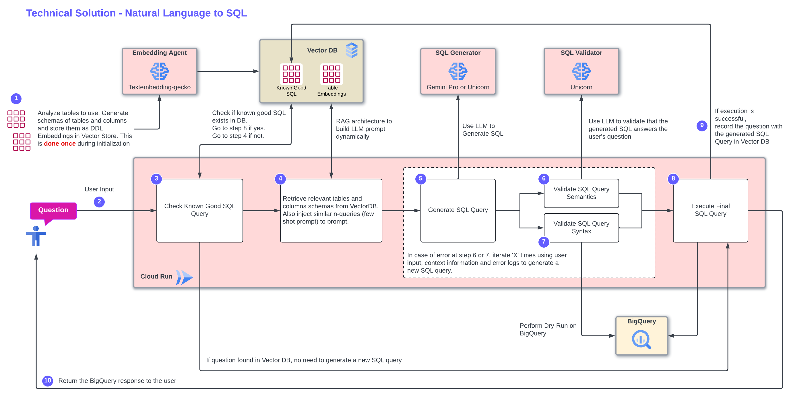

# Application to translate Natural Language to Bigquery SQL Query

## Google Disclaimer

This is not an officially supported Google Product

## Introduction

BigQuery is the platform of choice for many companies to store and analyze their data. It leverages SQL as high-level interaction language. Althought very common among data architects, some use-cases require end-user without technical knowledge to be able to perform queries on the data warehouse. An example is a marketing persona which uses the platform to explore the data and create customer segmentations. This persona will be more easily convinced to use a platform based on BigQuery if the interface does not require SQL knowledge, or proprietary custom language on top of BigQuery.

This project aims at providing an abstraction layer on top of BigQuery, offering natural language as the interface. The application then leverages state-of-the-art LLM models in order to convert the question to a BigQuery SQL query.

Several nl2sql approaches exists to achieve this, however there is no guarantee that the generated query actually matches the user's request. This can be problematic for complex tables, and a major blocker for the widespread adoption of such a solution. User's confidence in the result matching their initial request is paramount.

This application provides a reliable mechanism, leveraging a validation feedback loop, ensuring that the generated SQL Query is matching the user's intent.

Another complexity pertaining to BigQuery is the impossibility to predict costs, as queries are charged based on the amount of data scanned (for on-demand queries), and end-users may have unpredictable query behaviours, leading to undeterministic costs on BigQuery. Some solutions exists, and in particular for a complete end-to-end solution demonstrating the performance of this solution on complex and large data tables, please refer to the repository [`genai-powered-cdp`](https://github.com/fabloc/genai-powered-cdp) which simulates a Customer Data Platform by deploying events/users/products tables, with associated aggregated tables.


## Architecture

This application implements the following workflow:



To achieve this, the demo uses the following technologies:

Deployment:
- Cloud Build
- Artifact Registry

Execution:
- Cloud Run
- Vertex AI (Gemini Pro and Unicorn models)
- BigQuery
- Cloud SQL for PosgreSQL with pgvector extension

Application Stack
- UI/Front-end: Streamlit Framework
- Python 3.10


## Repository structure

```
.
├── app
└── config
    └── queries_samples
└── images
└── installation_scripts
    └── bigquery_dataset
    └── terraform
└── tools
```

- [`/app`](/app): Source code for demo app.  
- [`/config`](/config): Configuration files used by the application.
- [`/config/queries_samples`](/config/queries_samples): Sample questions with associated SQL queries that will be ingested inside the Vector Database during the provisioning of the resources.
- [`/images`](/images): Graphical assets used in the documentation pages.
- [`/installation_scripts`](/installation_scripts): Scripts used to install the application.
- [`/bigquery_dataset`](/installation_scripts/bigquery_dataset): Scripts used to import and generate the tables that will be used for the CDP demo.
- [`/installation_scripts/terraform`](/installation_scripts/terraform): Terraform files used to deploy the infrastructure for the demo.
- [`/tools`](/tools): Tools to be used to perform various maintenance tasks: debugging, cleaning the DB, etc.


# Environment Setup

Please follow the instructions detailed in the page [`/installation_scripts`](/installation_scripts) to set up the environment.


# Technical Deep-Dive

The application needs to be initialized with tables schemas. This is done automatically by providing the project_id, dataset_id, and optionally the table list inside the dataset (if none is provided, all tables in the dataset are considered for matching). The schemas are then converted to embeddings using the 'gecko-embedding' model (can be changed in the configuration file) and stored in the Vector Database in the 'table-embeddings' table.

Optionnally, samples questions/queries can be provided in yaml format. The process is the same: the question are converted to embeddings, and stored in the Vector Database alongside the valid SQL Query in the 'sql-embeddings' table.

When processing a user request, the following steps are executed:

1. application first tries to match the question exactly with a question stored in the Vector database. If there is a match, then the associated valid SQL Query is retrieved from the Vector DB and used as the final SQL Query.
2. If no match is found, then the application will try to find similar questions in Vector Database. If matches are found, they are injected in the LLM prompt, along with the associated SQL Query (few-shot prompt).
3. If similar questions have been found, Gemini Pro is used to execute the prompt. Gemini Pro is very good at identifying patterns in samples data, and excels at few-shot. It is also very quick to generate a result. On the other hand, if no similar question was dound then 'unicorn' model is used to execute the prompt. It is larger than Gemini, slower, but much more efficient at following complex rules in the prompt in 0-shot.
4. Once a SQL Query is generated, the validation feedback loop kicks in: 2 processes are executed in parallel: A dry-run of the SQL Query using BigQuery to validate the SQL Syntax, and a prompt using 'unicorn' model to validate that the generated SQL Query matches the initial user's intent. If an error is found in either the BigQuery dry-run or the LLM semantics validation, go back to step 3, and generate a new prompt, also injecting the errors identified, and previous errors as well.
5. If the validations were successful, the final SQL Query is executed against BigQuery and the results are displayed to the user. This behaviour can be changed in the configuration file.
6. The question and associated generated query are added to the Vector database for future matching.


# Getting help

If you have any questions or if you found any problems with this repository, please report through GitHub issues.
